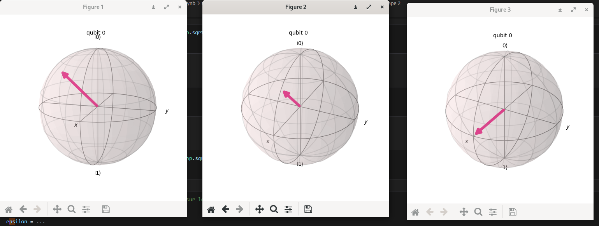
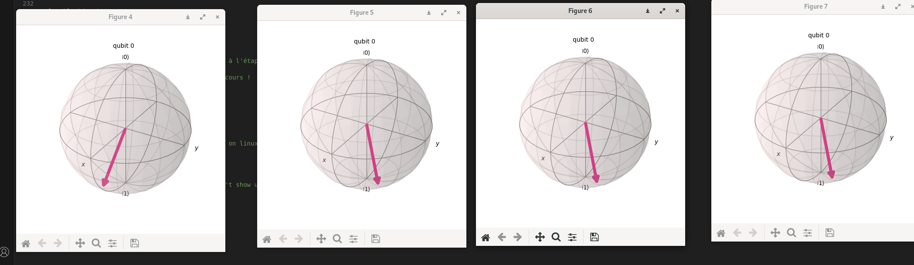

# Solution du challenge quantique
## 💡chall 1
L'énoncé du challenge se trouve dans le répertoire sujet. Pour pouvoir réaliser le chall, il faut avoir lu d'abord l'énoncé.
Pour le challenge 1, la trame est fournie mais il est demandé de compléter 3 parties pas implémentées, décrites ci-dessous.
- step 1
- step 2
- step final
Step 1&2 : la longue introduction avec les technologies permet de se familiariser avec les commandes & outils de perceval.

## 💡Quel est Parceval ?
(C'est un framework en source ouverte pour la programmation d'ordinateurs quantiques photoniques. Grâce à une API Python
simple orientée objet, Perceval fournit des outils pour composer des circuits à partir de composants optiques linéaires;
à définir des sources de photons uniques, manipuler des états de Fock, exécuter des simulations, reproduire des articles 
expérimentaux publiés et expérimenter une nouvelle génération d'algorithmes quantiques. Il vise à être un outil compagnon 
pour le développement de circuits photoniques – pour simuler et optimiser leur conception, pour modéliser, à la fois les 
comportements idéaux et réalistes puis proposer une interface normalisée pour les contrôler grâce au concept de backends*).

## 💡Un autre outil Qiskit : 
qui sert à visualiser les étapes de résolution et les éléments de solution est également utilisé sous formes de graphiques.

## Explications détaillées
Dans l'exercice final, après les essais en compléments, provenant des étapes successives du cours, qui ne servent donc pas 
à la résolution directe du challenge mais à la compréhension de ce qui suit, le drapeau est construit à partir de 3 valeurs.
A l'état finalisé ("finish-state") : il est demandé l'atteinte de l'objectif en faisant des rotations d'un angle déterminé.
Il faut amener le qubit à la position de la sphère de Bloch. Un état final de qubit est obtenu en utilisant des "circuits".
La sphère de Bloch est une grosse aide pour la résolution du chall. L'axe z est vers le haut (N) et (x,y) est dans le plan.
C'est parti pour atteindre les trous états auparavant évoqués à passer.

* Step 1 : avec l'outil du "Beam splitter" (voir le cours suivant)
* Step 2 : deux outils en chaînes 1) Beam splitter et 2) Déphaseur
* Step final 3 : l'énoncé nous impose une rotation en y et en z ici

Les essais hérités et les affichages par étape sont inutiles pourle flag mais illustrent le cours qui est décrit ensuite.

Nota bene : dans une rotation selon l'axe (Oz), on ne change pas le niveau Z; la rotation consiste à obtenir la niveau y.
*arrière-plans est la traduction de la notion des "backends".

* En étape 1 (Step 1) : quelle est la valeur de alpha pour avoir 90% de chance de voir passer les photons (probabilité 0.9)
et en réflechissant en 0,1 dans un autre état. La partie réfléchie a sa partie complexe avec la probabilité qui est réelle.

Annoter en convention la matrice exemple : E0 = cos(alpha/2) ;  S0 = sin (alpha/2) ; E1 = isin(alpha/2) ; S1 = cos(alpha/2)
Le passage est expliqué dans le cours ci-dessous : il y a ainsi la probabilité 0.9 d'avoir l'état S1: sin^2(alpha/2) = 0.9
alpha = 2*Arcsin(sqrt(0.9))

* En étape 2 (step 2): l'objectif est de construire un qubit dans l'état indiqué. Il y a deux angles car deux transformations
successives. Le BS est paramétré par bêta et suivi d'un déphaseur paramétré par gamma, positionné sur la voie 1 en S de BS.
Il existe l'exemple quasi identique dans le cours mais positionné sur la voie 0. Bêta joue le même rôle qu'alpha auparavant.

Il s'applique la matrice et la projection: psy = sqrt(3)/2 |0> + (sqrt(3)/4 - i/4) |1> et |0> en E mène à sqrt(3)/2 |0> en S.
Dans la matrice, qui sert d'appui à ce raisonnement, cela correspond à cos(bêta/2) = sqrt(3)/2 => bêta = 2*Arccos(sqrt(3)/2)
Si E = |0> dans le BS, on a donc S = cos ((bêta/2 |0>), isin (bêta/2 |1>)). Le déphaseur va alterner une phase. Or il attaque
la phase 1 (partie supérieure de la matrice); ça ne met pas en cause bêta. Dans l'exercice c'est un déphaseur en |1> non |0>.
Il s'agit d'une rotation de gamma de (4pi/3) de (-i/4) et il peut être évalué avec l'instruction de print fourni pour le test.

* En étape 3 (final step) : les portes vont s'enchaîner en quatre coups en tournant axe par axe. Le plus simple est de relancer 
la sphère de Bloch entre l'objectif (finish-state) et l'état du début (start-state) et de regarder : ce qu'il faut transformer.
La première rotation proposée est uniquement sur l'axe des z (Oz); on tourne d'abord sur l'axe des z (et on va ramener y à 0);
On veut aller en (x1, y0, z0) au point Hadamard. En 4 coups car d'abord il s'agit de tourner sur l'axe des z (on ramène y à O)
puis on va tourner sur l'axe des y pour ramener z à 0: on élimine y par une rotation sur z puis on élimine la composante z par
rotation autour de y (l'ordre est imposé par l'énoncé). A cela, delta = pi/4 et epsilon  = pi/4 donc 1/4 de tour x 2 successifs
dans 2 directions distinctes (à droite ou l'est avec le point de référence au nord puis en bas ou le sud de la sphère de Bloch).
Ensuite, on veut aller à l'état final. L'énoncé impose une rotation en y et en z. On commence à aligner le z avec: zeta = pi/4.
Quant à l'étape finale, une rotationen z de Pi d'angle êta fait atteindre la destination finale. Pour avoir le flag, il suffit
de poster les valeurs obtenues en step 1, en step 2, puis en step final et de pousser le flag, comme issu de cette combinaison.
Le chall réel est ce qui est envoyé. Les essais, inutiles au flag, figurent dans les affichages par étape, illustrant le cours.

# Programmation de ce challenge d'algorithmique quantique du 404 CTF !

Algorithmique-quantique-main\challenges\Chall1_reel.py' 
STEP 1  Beam splitter

L'analyser doit renvoyer : 1/10 pour 0 et 9/10 pour 1
+---+------+------+
|   |  0   |  1   |
+---+------+------+
| 0 | 1/10 | 9/10 |
+---+------+------+

STEP 2

Résultat : |φ> = (0.87+0j) |0> + (0.43-0.25j) |1>
Solution : |φ> = (0.87+0j) |0> + (0.43-0.25j) |1>

STEP final

{'message': 'Statut : en pleine forme !'}
{'message': 'GG ! Voici le drapeau : 404CTF{uN_r4Il_PoUr_2_Tr4iNs_eU_N0n_dEUx_r4ils_PoUR_1tRa1n}'}
PS D:\404ctf\404CTF-2024-Algorithmique-quantique-main\challenges>

Le flag : 404CTF{uN_r4Il_PoUr_2_Tr4iNs_eU_N0n_dEUx_r4ils_PoUR_1tRa1n}

